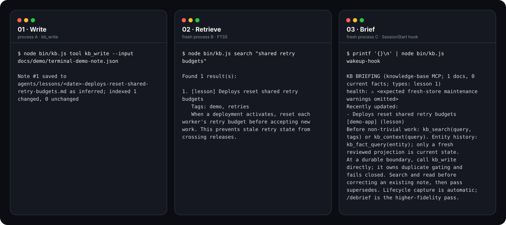

# kb-graph

**One coding agent learns. Every agent and future session can start knowing it.**

[](https://github.com/uttambharadwaj/kb-graph/actions/workflows/test.yml)
[](https://github.com/uttambharadwaj/kb-graph/releases/latest)
[](package.json)
[](LICENSE)

kb-graph gives Claude Code, Codex, Cursor, Gemini, and other MCP clients one
shared, searchable knowledge base. Notes remain files you own. The hard problem
is not storing them; it is keeping shared truth current as decisions change.

[](docs/assets/terminal-demo.svg)
*Real-process proof generated by [`scripts/generate-terminal-demo.mjs`](https://github.com/uttambharadwaj/kb-graph/blob/main/scripts/generate-terminal-demo.mjs): three actual kb-graph commands, three fresh Node processes, one isolated temporary `KB_DIR` and vault. Temporary paths, the note date, and expected fresh-store health warnings are normalized. This proves process-to-process persistence, not a cross-agent UI recording.*

Storage and retrieval are local. AI curation is not: harvesting,
classification, extraction, reconciliation, safety review, and synthesis invoke
your authenticated Claude CLI and may send selected transcript or note content
to its configured provider. The embedding model is downloaded on first use,
then runs locally.

## Install from source

Requirements:

- macOS or Linux
- Node.js 22, 24, or 26
- an installed, authenticated `claude` CLI for AI curation
- network access on first embedding use to download the model

Registry publication is deferred. Do not use `npm install -g kb-graph`, `npx
kb-graph`, or add kb-graph as a project dependency until a published package is
linked from this README.

`better-sqlite3` is a native dependency. npm normally downloads a prebuilt
binary; platforms without one need Python, `make`, and a C/C++ compiler for
the node-gyp fallback. The source tree does not contain the embedding model.
The first semantic operation downloads it to
`${KB_DIR:-~/.knowledge-base}/models`, which can be substantially larger than
the repository itself.

Keep the clone at a stable path because setup embeds it in registrations,
hooks, and scheduled jobs:

```bash
git clone https://github.com/uttambharadwaj/kb-graph.git
cd kb-graph
npm ci
node bin/kb.js setup
node bin/kb.js status
```

`npm link` is optional shorthand for exposing the `kb` executable. The
source-first commands in this guide use `node bin/kb.js ...` and do not require
that link.

The generated Docker Compose option assumes the operator provides a Dockerfile.
After setup writes
`${KB_DIR:-~/.knowledge-base}/.env`, later integrations are best-effort and
reported individually. Review the summary, then open a new configured agent
session. Claude Code, Codex, and Cursor should receive a **KB BRIEFING** at
session start.

For a teammate checklist, see [Onboarding](docs/ONBOARDING.md). Existing 1.x
users should read [Upgrading to 2.0](docs/UPGRADING-2.0.md).

## What setup changes

Depending on your answers, `node bin/kb.js setup`:

- creates or updates the owner-only `${KB_DIR:-~/.knowledge-base}/.env`;
- creates a Markdown vault (Obsidian is optional);
- registers MCP for Claude Code, Gemini, and Cursor;
- tells Codex users to run `node bin/kb.js register --agents=codex`, which
  prints the hand-managed `config.toml` block;
- installs supported hooks for Claude Code, Codex, and Cursor;
- installs four launchd or systemd-user jobs;
- copies bundled skills into `~/.claude/skills` without overwriting existing
  customizations; and
- optionally configures the HTTP server as a service.

Moving a source clone or changing the Node executable path breaks paths
embedded in those integrations. From the new location, re-run
`node bin/kb.js setup` for hooks/jobs and `node bin/kb.js register --force` for
MCP. Then restart Cursor and other agent clients.

Cursor must be restarted after registration. Starting from the command's
current directory, registration synchronizes the nearest ancestor
`.cursor/mcp.json` knowledge-base override with `~/.cursor/mcp.json`. If either
entry belongs to another checkout, both writes are refused unless `--force` is
passed. This restores Cursor agent attribution only; Cursor does not expose a
conversation/session identity for correlation.

## What each agent gets

- **Claude Code:** MCP, session briefing, prompt hints, trigger checks,
  pre-compaction continuity, optional post-tool capture checkpoints,
  daemon-backed lifecycle capture, and nightly transcript discovery.
- **Codex:** MCP after you paste the printed registration, session briefing,
  prompt hints, trigger checks, optional post-tool capture checkpoints,
  daemon-backed activity/pre-compaction capture, and nightly transcript
  discovery.
- **Cursor Desktop:** MCP, session-start briefing, nightly transcript
  discovery, and default-off lifecycle capture from native `stop` and
  `preCompact` events. Create `KB_DIR/cursor-capture-enabled` to opt in;
  `cursor-capture-disabled` wins. The Desktop queue-to-indexed-note round trip
  is proven. Cursor still has no per-prompt hint/trigger context channel,
  `sessionEnd` has no usable transcript path, and Cursor CLI/headless lifecycle
  support remains unproven.
- **Gemini:** MCP registration. Gemini transcripts are not automatically
  harvested and kb-graph does not install Gemini hooks.
- **Other clients:** point any MCP client at
  `node /absolute/path/to/kb-graph/bin/kb.js mcp-shim`.

Bundled `/debrief` and `kb-workflow` skills are installed only for Claude's
skill directory. Other agents can call the underlying MCP tools directly.
Lifecycle hooks enqueue capture requests; the optional `kb serve` daemon is
what drains that queue. Without it, the nightly transcript sweep remains the
automatic capture path. Cursor Desktop lifecycle capture is opt-in because
selected transcript text can pass through the authenticated Claude CLI during
curation.

## The loop

[](docs/assets/loop-demo.svg)
*Deterministic documentation illustration with synthetic data. Claude Code is
shown; Codex receives equivalent hook context. Cursor Desktop receives the
session briefing and can use `kb_write`, but receives no pushed prompt hints.*

### Retrieve

Pull context with `kb_search`, `kb_search_smart`, or `kb_context`. Claude Code
and Codex also receive sparse, precision-first hints when a prompt clearly
matches a note. Cursor receives the session briefing but not per-prompt hints.
See [Prompt hint retrieval](docs/hint-retrieval.md) for the scorer's measured
recall target and precision gates.

### Capture

Use `/debrief`, `kb_write`, `kb_capture_session`, or `kb_capture_fix` for
deliberate capture. This is the high-quality path: the agent can name the lesson
and preserve its evidence while the session is still fresh. Routine note
creation is one `kb_write` call: it owns semantic duplicate detection and
refuses without writing when that check is unavailable. Search and read first
when correcting an existing note, then pass `supersedes`.

Nightly harvest is a safety net, not guaranteed capture. By default it scans
Claude Code, Codex, and Cursor transcripts, but skips short, still-active,
subagent, and print-mode sessions. Work is capped per run and long transcripts
are processed in bounded chunks. Set `KB_HARVEST_SDK_SESSIONS=1` if print-mode
sessions are genuine work you want harvested. Fact extraction remains opt-in
with `KB_HARVEST_FACTS=1`. Scheduled jobs snapshot both settings, so rerun setup
after changing either one. Harvest uses the same fail-closed note writer; a
chunk whose duplicate check is unavailable remains incomplete and retries.

Claude Code and Codex also install a default-off PostToolUse checkpoint. It
classifies successful commit/merge, full verification, and release/deploy
boundaries, then records only the agent, native session key, checkpoint class,
permission mode, and outcome under `~/.knowledge-base/logs/checkpoints/`.
Command text and tool output are never logged. Create
`KB_DIR/checkpoint-hook-enabled` to emit at most two distinct reminders per
session; `KB_DIR/checkpoint-hook-disabled` is the kill switch. Failures, KB
tool calls, detectable subagents, missing identities, and write-denied sessions
never emit. Cursor post-tool checkpoints remain disabled until its
write-approval contract is verified.

Measure the default-off rollout with:

```bash
node bin/kb.js capture-follow-through --since <ISO-8601> --through <ISO-8601> --json
```
The aggregate report separates emitted and log-only cohorts, waits for each
30-minute immediate-capture window to mature, and reports delayed harvest
salvage separately. Claude and Codex use exact agent/session correlation;
Cursor candidates are counted by agent only and excluded from all correlation
denominators. Test sessions and other unattributable candidates are excluded
too. Session IDs, commands, prompts, output, and note bodies are never printed.
The same report evaluates the shipped synthetic checkpoint replay corpus for
precision, recall, and unsafe captures.

### Consolidate and review

Harvest folds recent sessions into current workstream state notes. Entity facts
retain provenance and history; reviewed projections represent current state
without rewriting raw evidence. Weekly synthesis reports themes,
contradictions, and cross-domain links.

## Why not just CLAUDE.md, a Memory Bank, or basic MCP memory?

Use `CLAUDE.md` and equivalent rule files for stable instructions that you
intend to curate by hand. They are simpler than kb-graph, and a checked-in rule
file can be shared by every client that reads it. What the file does not provide
by itself is indexed history, evidence and provenance, lifecycle capture, or
supersession when a decision changes.

A folder of session notes or a Memory Bank improves continuity and stays easy
to inspect. The tradeoff is maintenance: notes accumulate, retrieval depends on
what the agent happens to read, and stale statements can remain beside their
replacements. kb-graph keeps Markdown as the source you can inspect while
adding indexed retrieval, provenance, lifecycle capture, and supersession.
Scheduled reconciliation is narrower: it revisits supported fact-backed
decisions whose evidence came from harvest.

Basic MCP memory servers are a good fit when you need a small
store-and-retrieve tool. kb-graph is intentionally heavier because it also
tries to maintain shared truth over time. That means a database, optional
resident daemon, scheduled jobs, and more operational surface. It is not the
right choice if a checked-in rule file is enough. Storage and retrieval stay
local, but Claude-backed curation can send selected content to the configured
provider.

## Architecture

```text
Claude Code / Codex / Cursor / Gemini / MCP clients
                    |
             kb mcp-shim
         (one per client session)
              /           \
  optional kb serve      in-process fallback
  Unix-socket daemon      when daemon is absent
              \           /
               SQLite + FTS5
               local embeddings
               Markdown vault

Browser / remote clients
          |
       kb start
 dashboard + REST + HTTP MCP
          |
  same SQLite and vault
```

`kb serve` is the optional resident MCP and hook daemon. It does not host the
dashboard. `kb start` is the separate HTTP process. The HTTP server binds to
`127.0.0.1` by default; intentional remote access requires an explicit
`KB_HOST`, authentication, and a TLS-terminating reverse proxy.

See [Resident daemon setup](docs/daemon-setup.md) for restart behavior and
service definitions.

## Scheduled maintenance

Setup installs these four jobs:

- **03:30 daily — harvest:** extract durable lessons and fold state notes;
- **every 5 minutes — reindex:** sync vault Markdown into FTS and embeddings;
- **04:00 Sunday — synthesis:** surface themes, contradictions, and merge
  candidates; and
- **04:15 daily — reconcile:** revisit supported fact/retrieval decisions
  against their source evidence.

On macOS, job logs live under `~/.knowledge-base/logs/`; Linux jobs use the
systemd journal. These jobs may mutate indexed state or vault notes. The
session briefing reports loop health; inspect the logs for per-run details.

## Everyday commands

```bash
node bin/kb.js search "credential cache"        # terminal search
node bin/kb.js status                           # store and HTTP server status
node bin/kb.js harvest --dry-run                # preview transcript work
node bin/kb.js capture-follow-through --json    # checkpoint outcome report
node bin/kb.js serve --status                   # probe the optional daemon
node bin/kb.js start                            # local dashboard/API
node bin/kb.js migrate --check                  # read-only schema gate
node bin/kb.js register --agents=cursor         # sync home + workspace MCP config
```

`node bin/kb.js --help` lists maintenance and migration commands.

All 26 stdio tools are documented here so clients and maintainers can audit the
surface:

- retrieval: `kb_search`, `kb_search_smart`, `kb_context`, `kb_read`,
  `kb_list`, `kb_tunnels`;
- notes: `kb_write`, `kb_ingest`, `kb_check_duplicate`, `kb_supersede`,
  `kb_supersede_candidates`, `kb_classify`, `kb_extract`, `kb_promote`,
  `kb_synthesize`;
- facts: `kb_fact_add`, `kb_fact_query`, `kb_fact_timeline`,
  `kb_fact_invalidate`;
- capture: `kb_capture_session`, `kb_capture_fix`, `kb_capture_web`,
  `kb_capture_youtube`; and
- operations: `kb_wakeup`, `kb_vault_status`, `kb_safety_check`.

Nineteen non-admin tools, including mutating write and capture tools, are also
available over HTTP; seven administrative tools remain local-only. See
[Skills vs MCP](docs/SKILL-VS-MCP.md) for the complete surface and
[llms.txt](llms.txt) for agent-oriented reference.

`kb_write`, `kb_ingest`, REST ingest, and harvest own their fail-closed
similarity check. `kb_check_duplicate` is an exploratory check, not a mandatory
preflight. The bulk CLI command `node bin/kb.js ingest <path>` instead skips
only filenames it has already imported; it does not silently drop a requested
file because its content resembles an existing note.

## Data, privacy, and backups

- Primary application data lives in `${KB_DIR:-~/.knowledge-base}/`.
- Setup configuration, the generated `.env`, databases, logs, and the embedding
  model cache live under `KB_DIR`, outside the source checkout. Source updates
  do not replace them.
- The vault path is configured by `OBSIDIAN_VAULT_PATH`; it is plain Markdown.
- Retrieval uses SQLite FTS5 and `all-MiniLM-L6-v2` locally.
- Claude-backed write-time operations can send selected content to your Claude
  provider and can consume provider quota.
- The local HTTP boundary is loopback by default. Remote binding is an operator
  decision, not a setup default.
- Back up both the SQLite data directory and the vault. One is not a complete
  replacement for the other.

## More documentation

- [Onboarding and verification](docs/ONBOARDING.md)
- [Upgrading from 1.x](docs/UPGRADING-2.0.md)
- [Resident daemon](docs/daemon-setup.md)
- [Obsidian and vault layout](docs/OBSIDIAN-SETUP.md)
- [Skills vs MCP](docs/SKILL-VS-MCP.md)
- [Extending tools, schema, and HTTP](https://github.com/uttambharadwaj/kb-graph/blob/main/EXTENDING.md)
- [Contributing](https://github.com/uttambharadwaj/kb-graph/blob/main/CONTRIBUTING.md)

CI validates Node 22, 24, and 26. Green CI is not deployment proof: releases,
deploy-line reconciliation, database migration, and daemon rollout are manual
operator steps.

For an update, pull the source checkout and run `npm ci`. Then run
`node bin/kb.js migrate --check`, apply pending changes with
`node bin/kb.js migrate`, and restart the configured services and agent
sessions. Re-run `node bin/kb.js setup` when the install path, Node version, or
scheduled-job environment changes. Existing databases fail loudly rather than
auto-migrating when opened by newer code.

## Lineage and license

kb-graph began as a fork of
[knowledge-base-server](https://github.com/willynikes2/knowledge-base-server)
by Shawn Daniel, the engine behind [Memstalker](https://memstalker.com). This
fork adds transcript harvesting, state consolidation, fact timelines,
synthesis, push retrieval, and a resident multi-client daemon.

MIT — see [LICENSE](LICENSE). Copyright Shawn Daniel and Uttam Bharadwaj.
